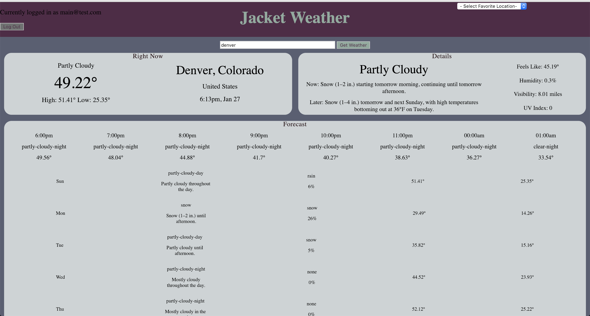

# README
## Jacket Weather




Jacket Weather is a front-end-only weather app designed to allow a user to lookup weather forecasts by location.  Jacket Weather consumes data from the Sweater Weather API, which utilizes Google and Dark Sky APIs for geocoding and weather data, respectively.

### Setup:

To begin, clone this repo:

```
git@github.com:DanHutch/jacket-weather.git
```
After you `cd` into the project directory, run `npm install` from the command line.

At this point, you should be able to view the locally hosted app at http://localhost:8080/ after starting a local server using the command `npm start`.

### Back-End
Jacket Weather uses the Sweater Weather back-end API found at https://github.com/DanHutch/sweater_weather and hosted on Heroku at https://infinite-badlands-14969.herokuapp.com/ (no page exists at this address, but this is the base URL for the API endpoints.)

### Future Iterations:

- Add new user registration functionality.

- Add functionality for logged-in user adding a new favorite location, as well as deleting favorites.

- Add Icons to weather data displayed on page.


### Contributing:

In order to contribute, please fork this repo, then clone your new repo and create a branch for your feature.

Please make sure to test your feature thoroughly, then create and submit a pull request back to this repository.

Please contact Dan Hutchinson (DanHutch) on Github if you have any questions, etc. Thank you!
